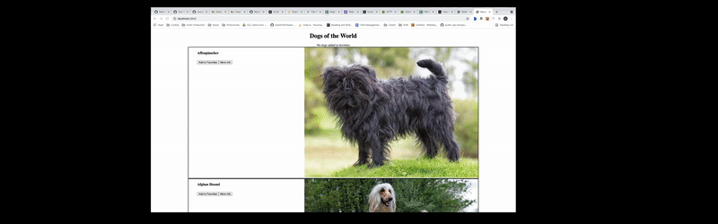

# ReactReviewDogs

### Getting Started
1. Run `npm install` to install the project dependencies
2. Run `npm run build` to start Webpack and transpile your files into dist/bundle.js
3. Run `npm start` to start up the server and serve up index.html
4. Open `localhost:3500` in your browser to see the page

### What We'll Be Building

### Steps to Complete

- [ ] Set up App component in App.jsx
- [ ] Render App to index.html via index.jsx
- [ ] Import dog data from data/dogs.js, and store it in App's state once the page has loaded (via a lifecycle method)
- [ ] Set up DogList and DogEntry components in their respective files (create DogEntry as a functional stateless component first, using the just the html under the 'LESS INFO' comment)
- [ ] Have App render the DogList component, and the DogList component render one DogEntry for each dog object in the App's state
- [ ] Add functionality for the 'Add to Favorites' button on each of the DogEntries, storing added dogs in App's state (ideally we want to avoid duplicate dogs getting added)
- [ ] Set up Favorites component to render the 'fav-entry' html for each dog in the favorites list
- [ ] Add functionality for the 'Remove from Favorites' button associated with each dog in favorites
- [ ] Re-factor DogEntry to be a class component, and set it up to conditionally render either the 'More Info' or 'Less Info' html, depending on if the 'More Info' button has been clicked
